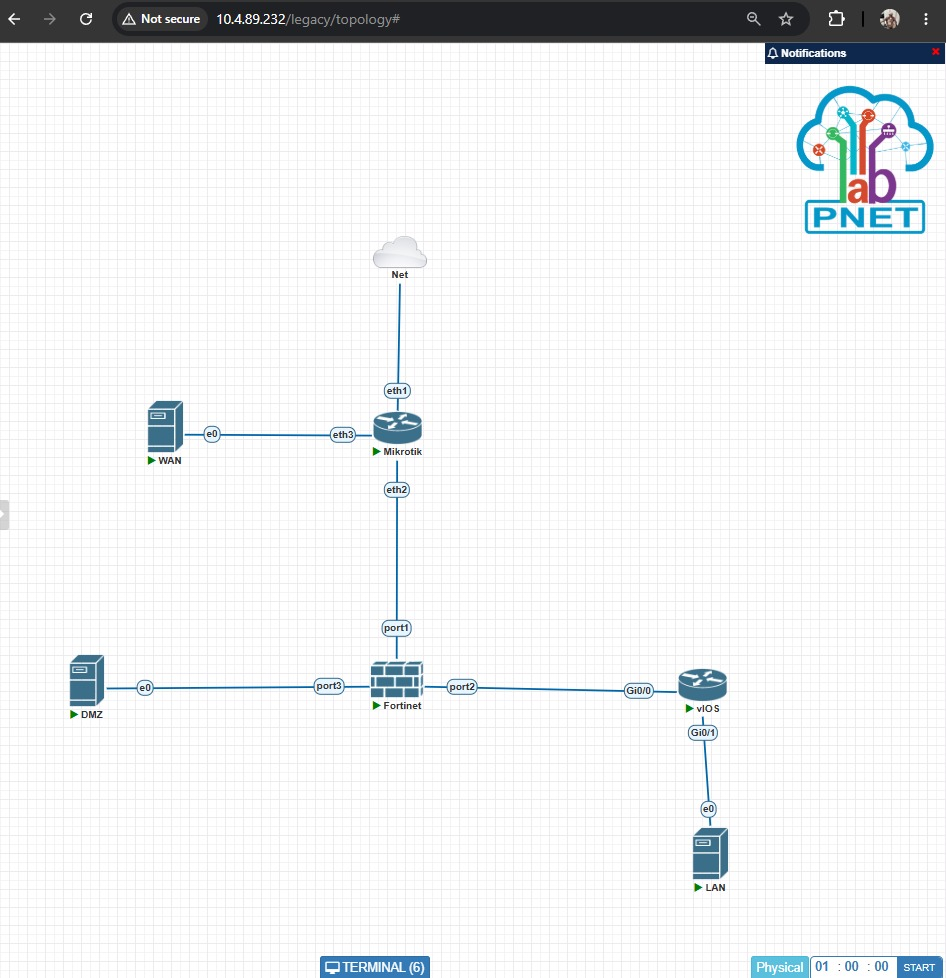

# 5.10 Dokumentasi
Simpan laporan di LA/README.md dengan isi:

Topologi jaringan
Tabel IP address
Konfigurasi tiap perangkat (+ screenshot)
Hasil pengujian (+ screenshot)
Analisis dan kesimpulan

---

# 1. Topologi Jaringan

## Topologi



---

# 2. Tabel IP Address


---

# 3. Konfigurasi Tiap Perangkat

## Router

### Konfigurasi IP Address

```bash
/ip address add address=10.10.10.1/24 interface=ether2
/ip address add address=10.20.20.1/24 interface=ether3
```

### Screenshot


---

### Konfigurasi DHCP Server

```bash
/ip dhcp-server add name=dhcp1 interface=ether2
```

### Screenshot


---

### Konfigurasi NAT

```bash
/ip firewall nat
add chain=srcnat out-interface=ether1 action=masquerade
```

### Screenshot


---

# 4. Hasil Pengujian

## Ping PC A ke Router

Screenshot:


Hasil:
Ping berhasil tanpa packet loss.

---

## Ping PC A ke Internet

Screenshot:


Hasil:
Host berhasil mengakses internet.

---

## Ping PC A ke PC B

Screenshot:


Hasil:
Komunikasi antar host berhasil.

---

# 5. Analisis dan Kesimpulan

## Analisis

Berdasarkan hasil konfigurasi, seluruh perangkat berhasil memperoleh alamat IP sesuai subnet masing-masing. DHCP Server mampu mendistribusikan alamat IP secara otomatis kepada client. NAT yang dikonfigurasi pada router memungkinkan seluruh host mengakses jaringan internet melalui satu alamat IP publik.

## Kesimpulan

Konfigurasi IP Address, DHCP Server, dan NAT berhasil diterapkan. Seluruh host dapat berkomunikasi dengan router, antar host, dan internet sesuai dengan tujuan praktikum.
