# Dokumentasi Laporan Akhir Praktikum Jaringan Komputer — Modul 5
## Kelompok 28
1. Mohammad Khirz El Jausyan (5024241009)
2. Atika Najwa Azzahra (5024241011)
3. Kenny Gabriel Manurung (5024241022)
4. Yoga Andreas Hutajulu (5024241021)

---

# 1. Topologi Jaringan

Implementasi Jaringan Enterprise HQ–Branch dengan dual gateway menggunakan VRRP, DHCP terpusat (ISC-DHCP Relay), FortiGate Firewall, GRE Tunnel, dan OSPF Routing dinamis.

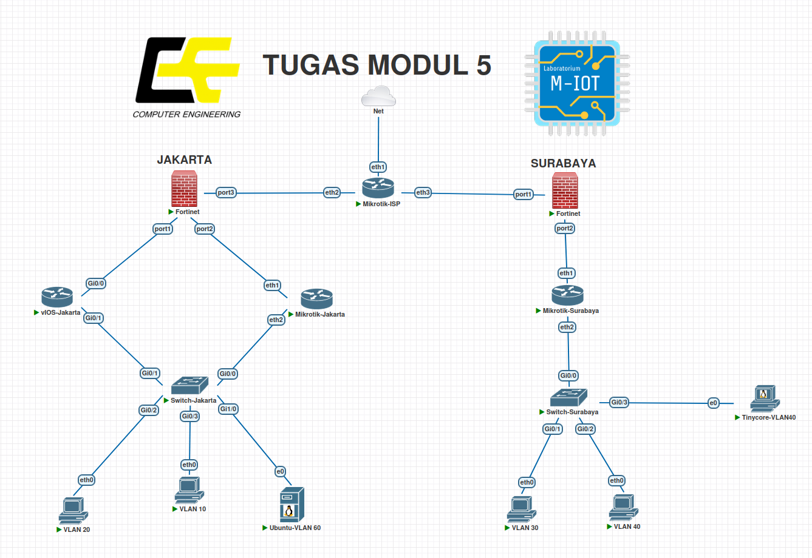

---

# 2. Tabel IP Address

| Perangkat | Interface | IP Address | Gateway | Keterangan |
| :--- | :--- | :--- | :--- | :--- |
| **Cisco Switch Jakarta** | Gi0/0 Gi0/1 Gi0/2 Gi0/3 Gi1/0 | - | - | Trunk ke Cisco Router JKT Trunk ke MikroTik JKT Access port VLAN 20 (IT) Access port VLAN 10 (Finance) Access port VLAN 60 (Server) |
| **Cisco Router Jakarta** | Gi0/1.10 Gi0/1.20 Gi0/1.60 Gi0/0 | 192.168.10.2/24 192.168.20.2/24 192.168.60.2/24 10.10.100.2/30 | Virtual IP: 192.168.10.1 Virtual IP: 192.168.20.1 Virtual IP: 192.168.60.1 10.10.100.1 (FortiGate) | Subinterface VLAN 10 (VRRP Master, Priority 120) Subinterface VLAN 20 (VRRP Backup, Priority 90) Subinterface VLAN 60 (VRRP Master, Priority 100) Link Transit ke FortiGate JKT |
| **MikroTik Router Jakarta** | vlan10-finance vlan20-it vlan60-server ether1 | 192.168.10.3/24 192.168.20.3/24 192.168.60.3/24 10.10.101.2/30 | Virtual IP: 192.168.10.1 Virtual IP: 192.168.20.1 Virtual IP: 192.168.60.1 10.10.101.1 (FortiGate) | Interface VLAN 10 (VRRP Backup, Priority 90) Interface VLAN 20 (VRRP Master, Priority 120) Interface VLAN 60 (VRRP Backup, Priority 90) Link Transit ke FortiGate JKT |
| **Ubuntu Server Jakarta** | eth0 | 192.168.60.10/24 | 192.168.60.1 (VRRP VIP) | Server DHCP (ISC-DHCP-Server) & Nginx Web Server |
| **FortiGate Jakarta** | port1 port2 port3 GRE-JKT-SBY | 10.10.100.1/30 10.10.101.1/30 10.0.12.2/30 172.16.0.1/32 | - - 10.0.12.1 (ISP) - | Link ke Cisco JKT Link ke MikroTik JKT Link WAN ke ISP Tunnel IP GRE (Remote: 10.0.13.2) |
| **MikroTik ISP** | ether1 ether2 ether3 | DHCP (Dynamic IP) 10.0.12.1/30 10.0.13.1/30 | - - - | Cloud NAT / Internet Link ke FortiGate JKT WAN Link ke FortiGate SBY WAN |
| **Cisco Switch Surabaya** | Gi0/0 Gi0/1 Gi0/2 Gi0/3 | - | - | Trunk ke MikroTik SBY Access port VLAN 30 (Sales) Access port VLAN 40 (Operations) Access port VLAN 40 (Operations) |
| **MikroTik Surabaya** | vlan30-sales vlan40-operations ether1 | 192.168.30.1/24 192.168.40.1/24 10.10.200.2/30 | - - 10.10.200.1 (FortiGate) | Gateway VLAN 30 (DHCP Server Lokal) Gateway VLAN 40 (Static) Link Transit ke FortiGate SBY |
| **FortiGate Surabaya** | port1 port2 GRE-SBY-JKT | 10.0.13.2/30 10.10.200.1/30 172.16.0.2/32 | 10.0.13.1 (ISP) - - | Link WAN ke ISP Link ke MikroTik SBY Tunnel IP GRE (Remote: 10.0.12.2) |
| **PC Client** | VLAN 10 (Jakarta) VLAN 20 (Jakarta) PC Sales (Surabaya) PC Operations (Surabaya) PC Operations Tinycore | DHCP (192.168.10.0/24) DHCP (192.168.20.0/24) DHCP (192.168.30.0/24) 192.168.40.10/24 192.168.40.20/24 | 192.168.10.1 192.168.20.1 192.168.30.1 192.168.40.1 192.168.40.1 | Client Finance JKT Client IT JKT Client Sales SBY Client Operations SBY (Static) Client Operations Tinycore SBY (Static) |

---

# 3. Konfigurasi Tiap Perangkat

## A. HQ Jakarta (Pusat)

### 1. Cisco Switch Jakarta
Switch Jakarta dikonfigurasi untuk membagi traffic local ke VLAN 10 (Finance), VLAN 20 (IT), dan VLAN 60 (Server). Trunking diatur pada interface Gi0/0 dan Gi0/1 yang terhubung ke gateway Cisco dan MikroTik Router.

* **Status VLAN database (`show vlan brief`):**
  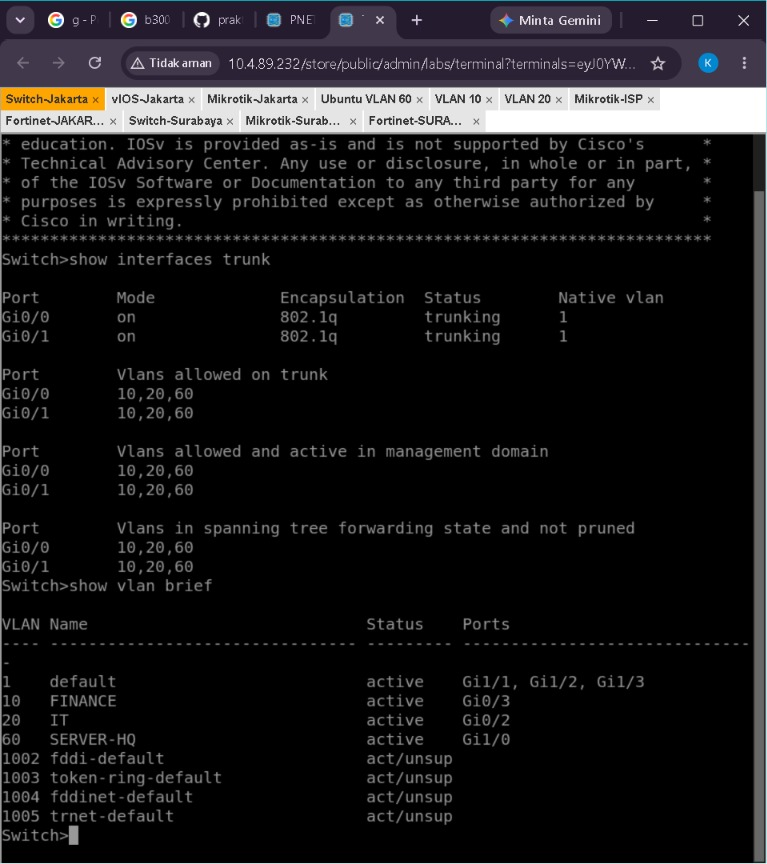
  *VLAN 10 (FINANCE) aktif di port Gi0/3, VLAN 20 (IT) aktif di port Gi0/2, dan VLAN 60 (SERVER-HQ) aktif di port Gi1/0.*

* **Status Trunking (`show interfaces trunk`):**
  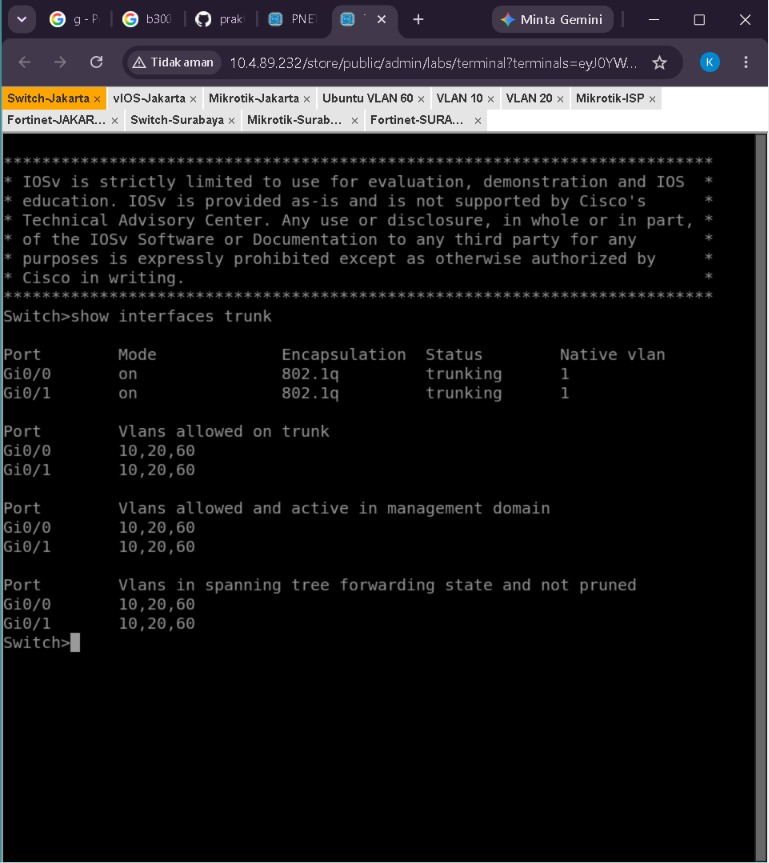
  *Link trunking aktif pada interface Gi0/0 dan Gi0/1 menggunakan enkapsulasi 802.1q dengan status trunking. VLAN 10, 20, dan 60 diizinkan melewati trunk.*

---

### 2. Cisco Router Jakarta
Cisco Router Jakarta bertindak sebagai gateway utama (VRRP Master) untuk VLAN 10 dan VLAN 60. Interface Gi0/1 dipecah menjadi subinterface untuk masing-masing VLAN. DHCP Relay diaktifkan agar client VLAN 10 & 20 dapat memperoleh IP dari Ubuntu Server.

* **IP Interface Brief (`show ip interface brief`):**
  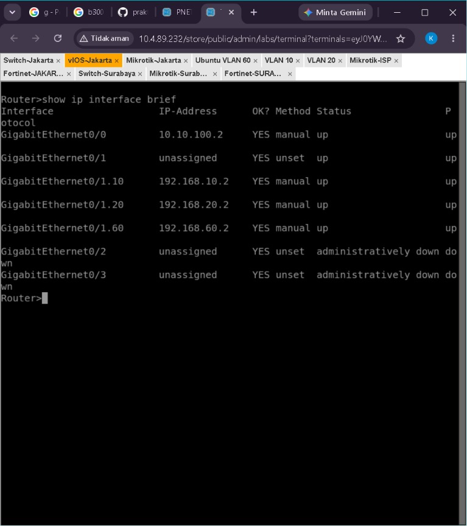
  *Subinterface GigabitEthernet0/1.10 (192.168.10.2), GigabitEthernet0/1.20 (192.168.20.2), dan GigabitEthernet0/1.60 (192.168.60.2) berada dalam status UP/UP. Interface Gi0/0 yang mengarah ke FortiGate terkonfigurasi dengan IP 10.10.100.2.*

* **Konfigurasi VRRP (`show vrrp brief`):**
  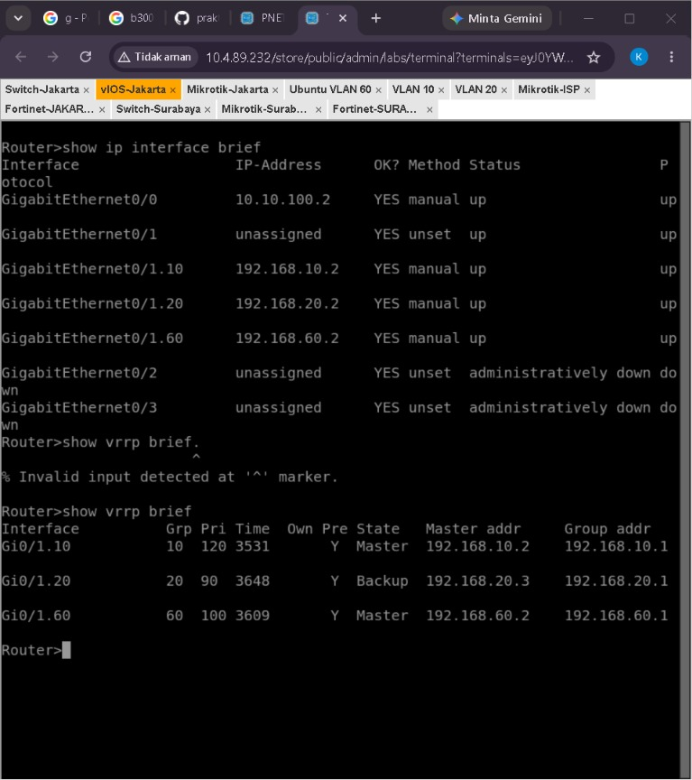
  *Cisco Router bertindak sebagai VRRP Master untuk Group 10 (VLAN 10) dan Group 60 (VLAN 60) dengan virtual IP masing-masing 192.168.10.1 dan 192.168.60.1. Untuk Group 20 (VLAN 20), statusnya adalah Backup dengan Master di router tetangga (MikroTik).*

* **Konfigurasi Subinterface (`show running-config`):**
  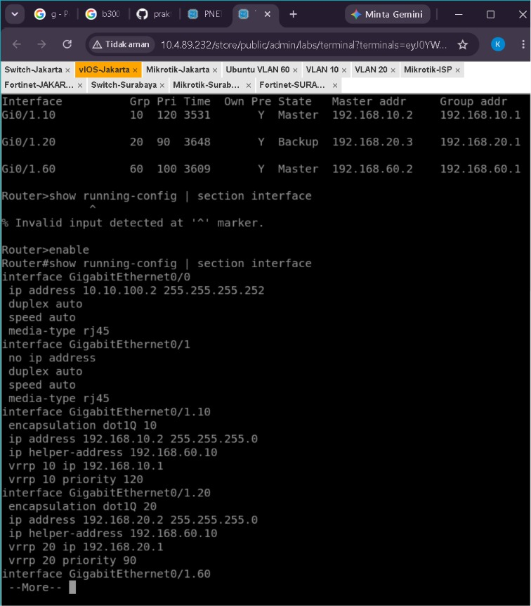
  *Konfigurasi lengkap subinterface menunjukkan enkapsulasi dot1Q, alamat IP fisik, `ip helper-address 192.168.60.10` untuk DHCP relay, serta konfigurasi VRRP.*

* **Konektivitas ke Firewall FortiGate Jakarta (`ping 10.10.100.1`):**
  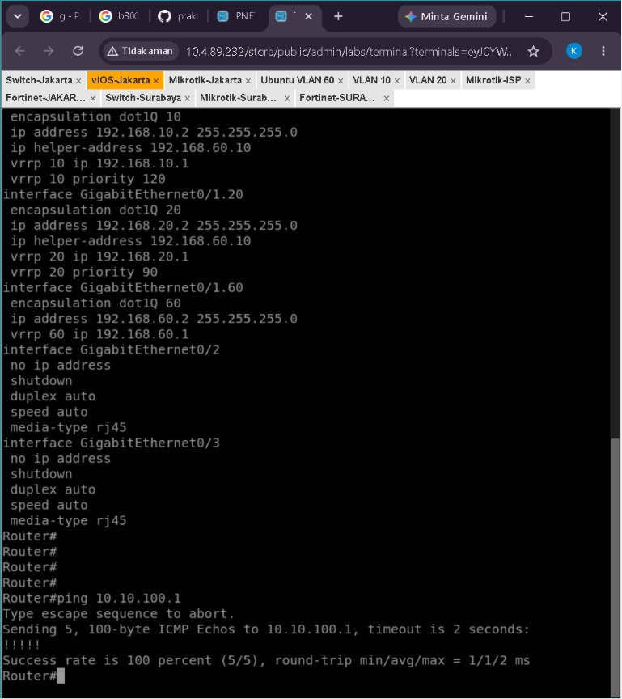
  *Uji ping dari Cisco Router ke FortiGate Jakarta (10.10.100.1) berhasil dengan success rate 100% (5/5).*

---

### 3. MikroTik Router Jakarta
MikroTik Router Jakarta bertindak sebagai gateway utama (VRRP Master) untuk VLAN 20 (IT) dan gateway cadangan (VRRP Backup) untuk VLAN 10 dan 60. DHCP Relay dikonfigurasi pada interface vlan10 dan vlan20 menuju Ubuntu Server.

* **Alokasi IP Address (`/ip address print`):**
  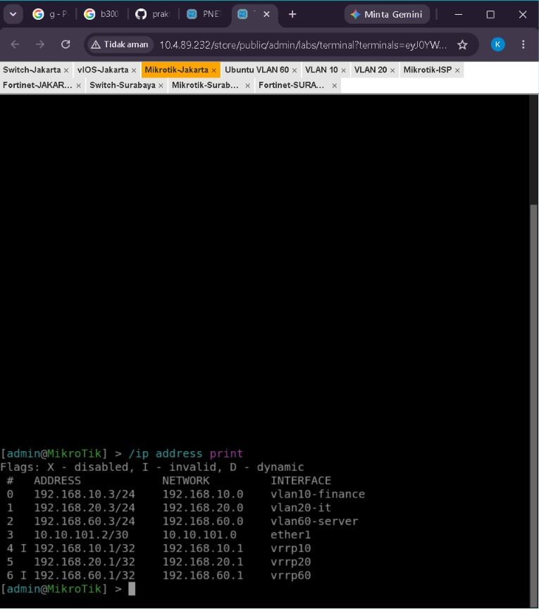
  *IP fisik dikonfigurasi pada interface vlan10-finance (192.168.10.3), vlan20-it (192.168.20.3), vlan60-server (192.168.60.3), serta ether1 ke FortiGate (10.10.101.2). Virtual IP VRRP 10, 20, dan 60 ditambahkan ke interface VRRP.*

* **Konfigurasi VRRP (`/interface vrrp print`):**
  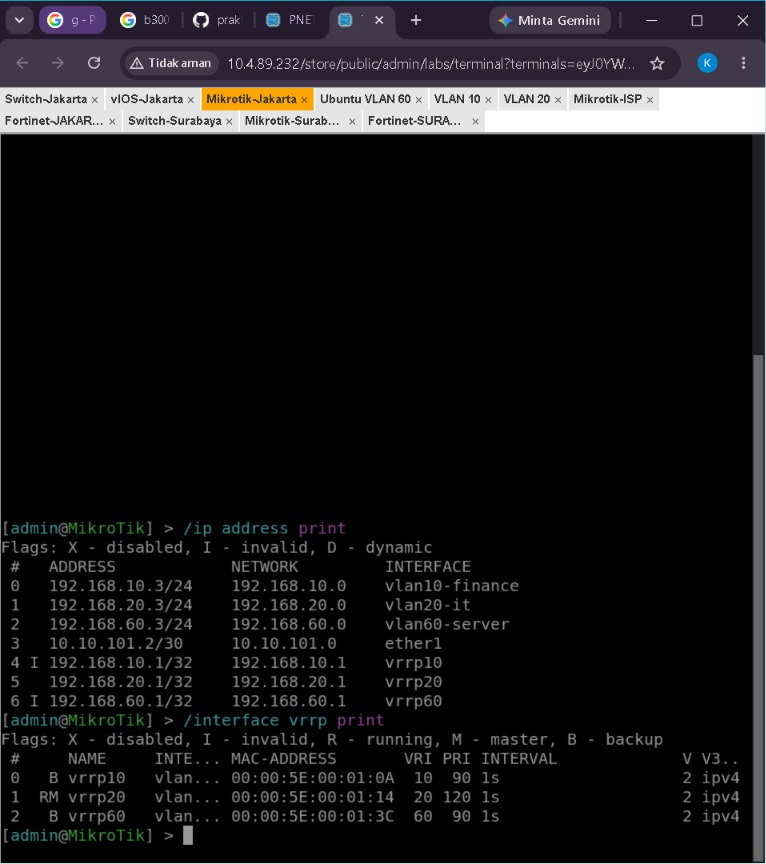
  *Status VRRP pada MikroTik: vrrp20 berstatus Master (running, priority 120), sedangkan vrrp10 dan vrrp60 berstatus Backup (priority 90).*

* **DHCP Relay (`/ip dhcp-relay print`):**
  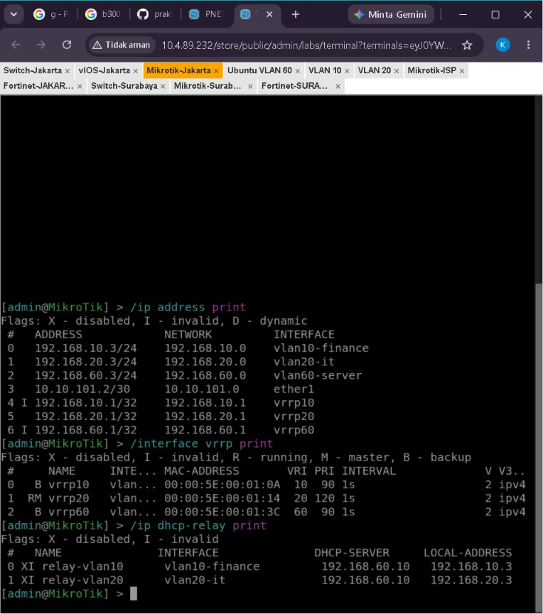
  *DHCP Relay aktif pada vlan10-finance dan vlan20-it, meneruskan request DHCP client ke IP DHCP Server (192.168.60.10).*

* **Routing Table (`/ip route print`):**
  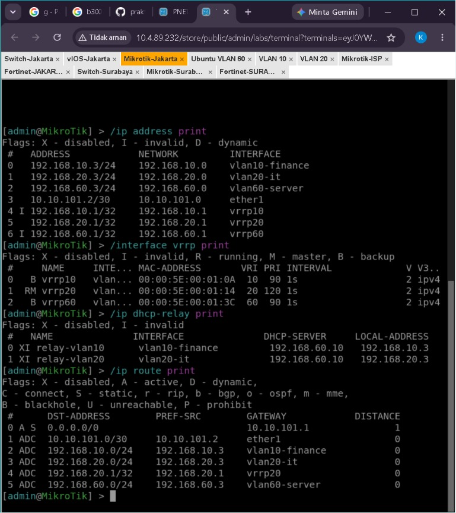
  *MikroTik memiliki default route (0.0.0.0/0) dengan gateway transit FortiGate Jakarta (10.10.101.1).*

* **Konektivitas ke FortiGate Jakarta (`ping 10.10.101.1`):**
  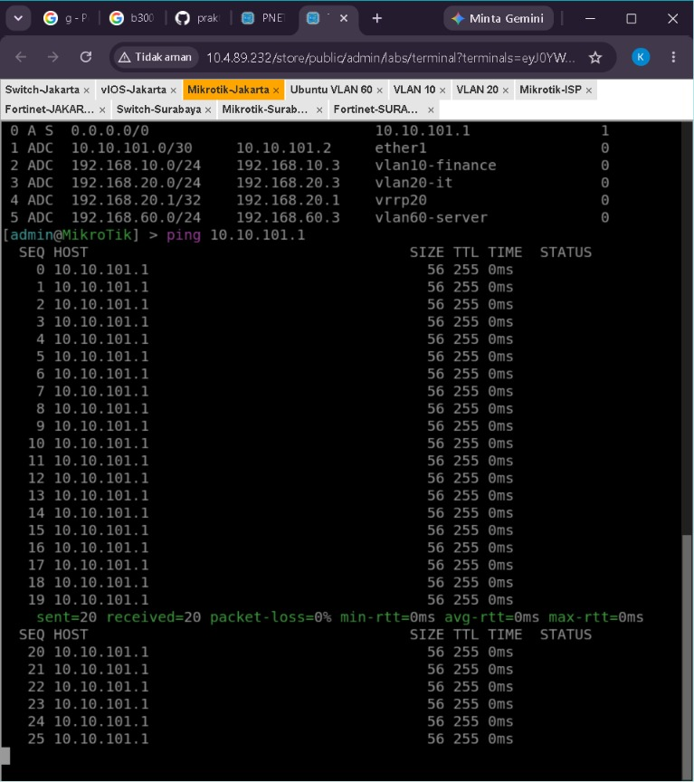
  *Uji ping dari MikroTik Router Jakarta ke port transit FortiGate Jakarta (10.10.101.1) berhasil dengan packet loss 0%.*

---

### 4. Ubuntu Server Jakarta
Ubuntu Server dikonfigurasi statis pada VLAN 60 (Server). Server ini menjalankan dua service utama: ISC-DHCP Server (alokasi IP dinamis untuk client VLAN 10 dan 20) dan Nginx Web Server (sebagai destination server pengujian akses dari cabang).

* **Alokasi IP Address (`ip a`):**
  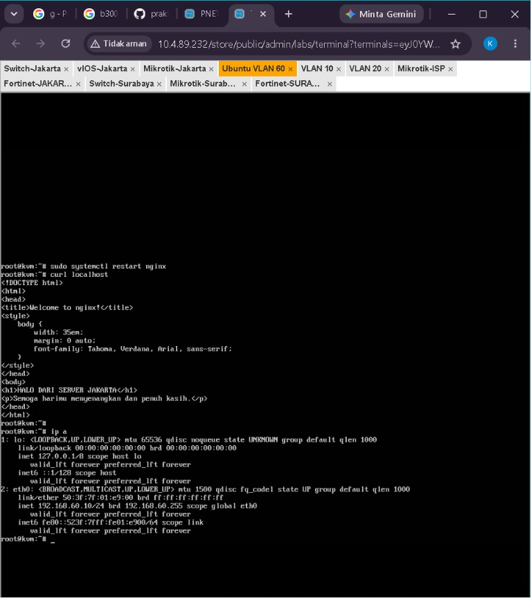
  *Interface eth0 menggunakan IP static 192.168.60.10/24.*

* **Routing Table (`ip route`):**
  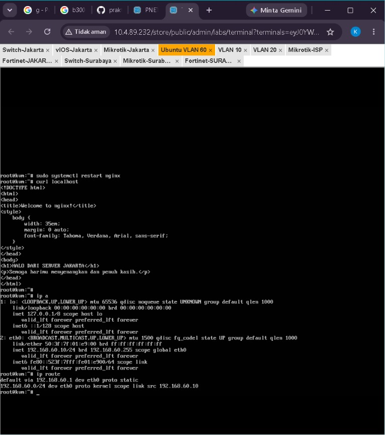
  *Default gateway Ubuntu Server diarahkan ke Virtual IP VRRP VLAN 60 yaitu 192.168.60.1.*

* **Konfigurasi ISC-DHCP (`cat /etc/dhcp/dhcpd.conf`):**
  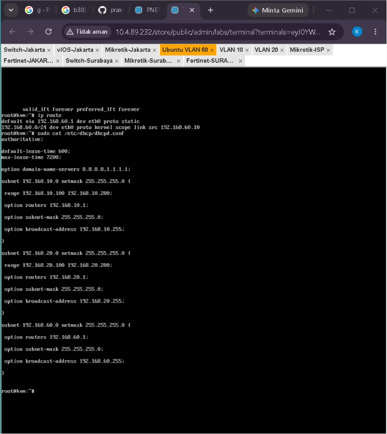
  *File konfigurasi DHCP mendefinisikan subnet 192.168.10.0 (VLAN 10) dengan range 100-200 dan gateway 192.168.10.1, subnet 192.168.20.0 (VLAN 20) dengan range 100-200 dan gateway 192.168.20.1, serta subnet 192.168.60.0.*

* **Status Layanan DHCP (`systemctl status isc-dhcp-server`):**
  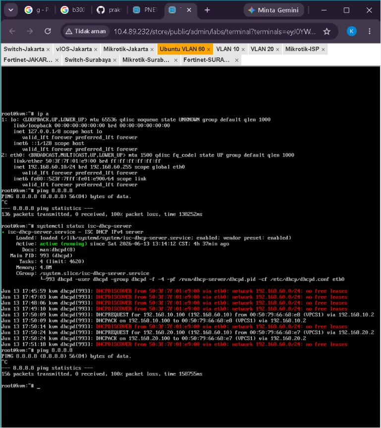
  *Status layanan DHCP Server berjalan aktif (running) dan log menunjukkan berhasil menangani proses DORA untuk alokasi IP client.*

---

### 5. FortiGate Jakarta
FortiGate Jakarta merupakan security edge untuk HQ Jakarta. FortiGate ini bertindak sebagai firewall filter, NAT gateway ke internet, serta endpoint GRE Tunnel menuju FortiGate Surabaya. Routing ke arah internal Jakarta dilewatkan ke static route, sedangkan routing ke Surabaya dilewatkan secara dinamis melalui OSPF.

* **Status Physical Interface (`get system interface physical`):**
  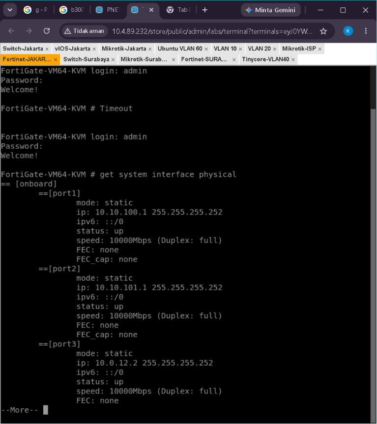
  *Status interface port1 (ke Cisco), port2 (ke MikroTik), dan port3 (ke ISP) dalam kondisi UP dengan IP address static masing-masing.*

* **Routing Table (`get router info routing-table all`):**
  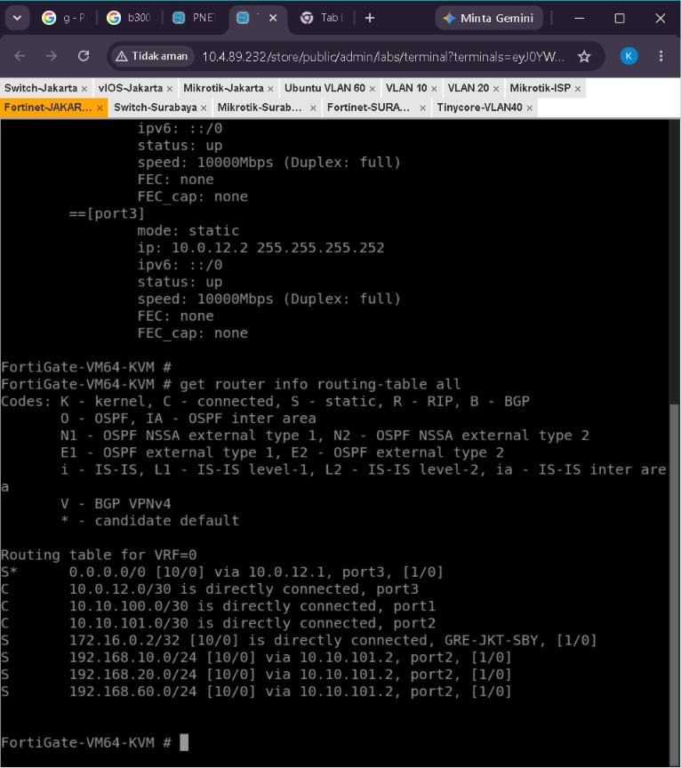
  *Menampilkan rute default 0.0.0.0/0 via gateway ISP (10.0.12.1), rute langsung ke segmen transit (10.10.100.0/30 dan 10.10.101.0/30), rute GRE Tunnel (172.16.0.2), serta rute statis internal.*

* **Firewall Policy (`show firewall policy`):**
  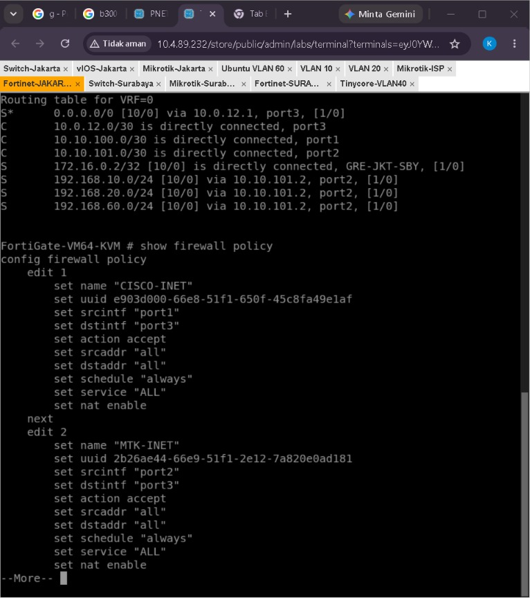
  *Konfigurasi firewall policy mengizinkan traffic keluar dari interface internal (Cisco/MikroTik) ke internet (port3 WAN) dengan mengaktifkan NAT.*

* **Konektivitas ke Internet (`execute ping 8.8.8.8`):**
  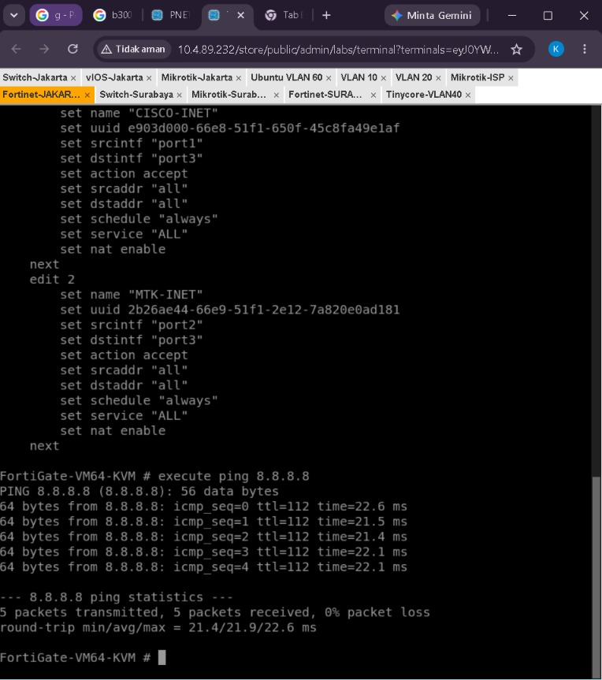
  *Uji ping dari FortiGate Jakarta ke DNS Google (8.8.8.8) berhasil.*

* **Konektivitas GRE ke FortiGate Surabaya (`execute ping 172.16.0.2`):**
  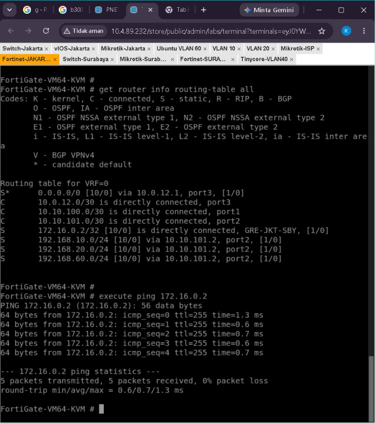
  *Uji ping ke IP GRE Tunnel sisi Surabaya (172.16.0.2) berhasil dengan 0% packet loss.*

* **OSPF Neighbor (`get router info ospf neighbor`):**
  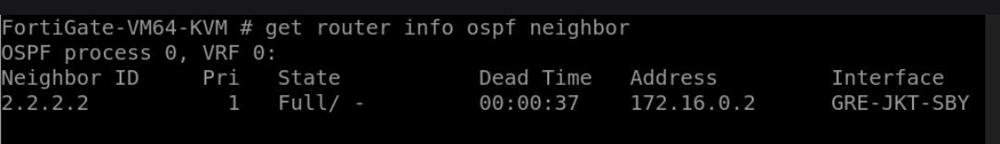
  *Koneksi OSPF adjacency berhasil terbentuk secara dinamis di atas GRE Tunnel dengan status FULL.*

* **OSPF Routing Table (`get router info routing-table ospf`):**
  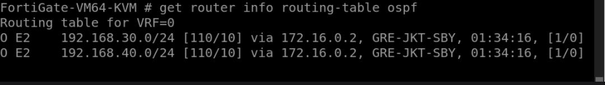
  *FortiGate Jakarta berhasil mempelajari rute internal cabang Surabaya (VLAN 30: 192.168.30.0/24 dan VLAN 40: 192.168.40.0/24) via GRE Tunnel.*

---

## B. Jaringan Internet & ISP

### 1. MikroTik ISP
MikroTik ISP mensimulasikan jaringan publik (Provider). Router ini menghubungkan FortiGate Jakarta dan FortiGate Surabaya secara point-to-point. Layanan internet disalurkan menggunakan dynamic IP (DHCP Client) pada ether1 ke Cloud NAT PNETLab, kemudian didistribusikan ke FortiGate melalui NAT Masquerade.

* **Alokasi IP Address (`/ip address print`):**
  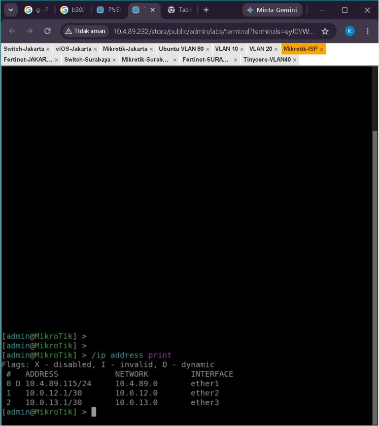
  *Interface ether1 mendapatkan IP dinamis (10.4.89.115/24) dari lab network. Alamat IP static dikonfigurasi pada ether2 (10.0.12.1/30) dan ether3 (10.0.13.1/30).*

* **Routing Table ISP (`/ip route print`):**
  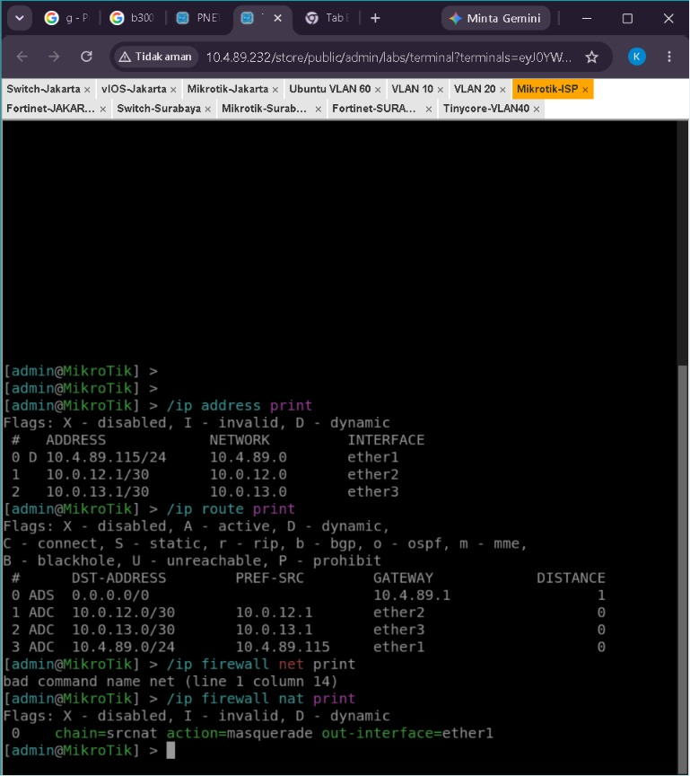
  *Tabel routing menunjukkan rute default (0.0.0.0/0) via gateway lab (10.4.89.1) berstatus active static (AS).*

* **Firewall NAT (`/ip firewall nat print`):**
  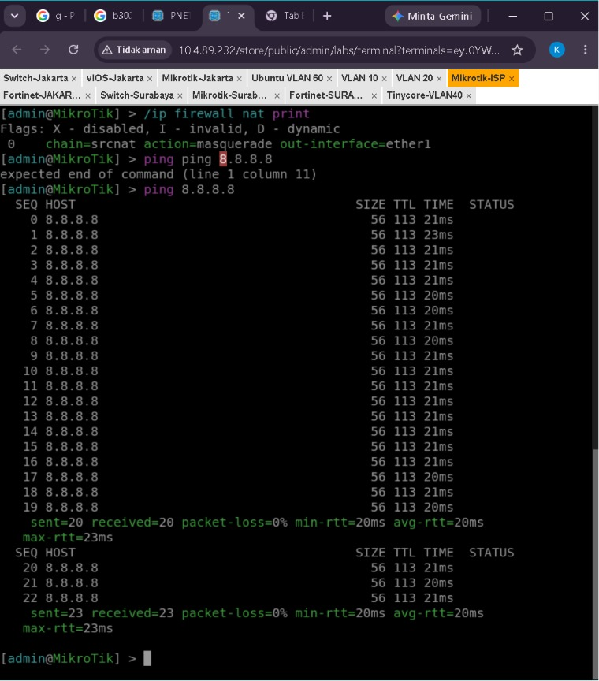
  *Aturan NAT Masquerade aktif pada out-interface ether1 untuk meneruskan trafik client lab ke internet.*

* **Konektivitas Internet dan WAN (`ping`):**
  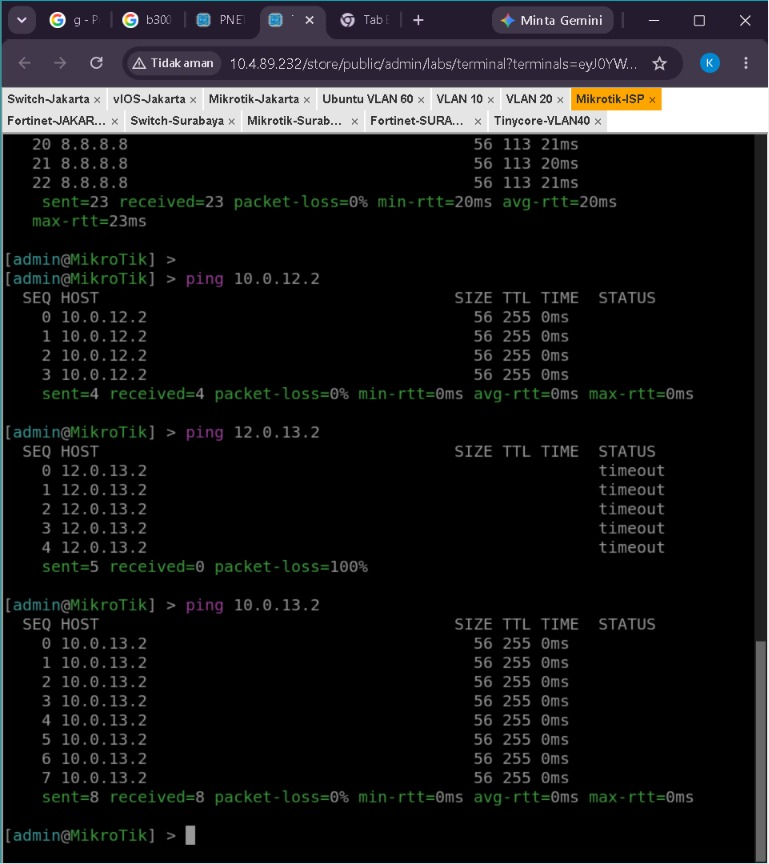
  *Uji ping dari MikroTik ISP ke DNS Google (8.8.8.8), port WAN FortiGate Jakarta (10.0.12.2), dan port WAN FortiGate Surabaya (10.0.13.2) semuanya berjalan sukses tanpa loss.*

---

## C. Branch Surabaya (Cabang)

### 1. Cisco Switch Surabaya
Switch Surabaya menghubungkan client VLAN 30 (Sales) dan VLAN 40 (Operations) ke gateway MikroTik Surabaya.

* **Status VLAN database (`show vlan brief`):**
  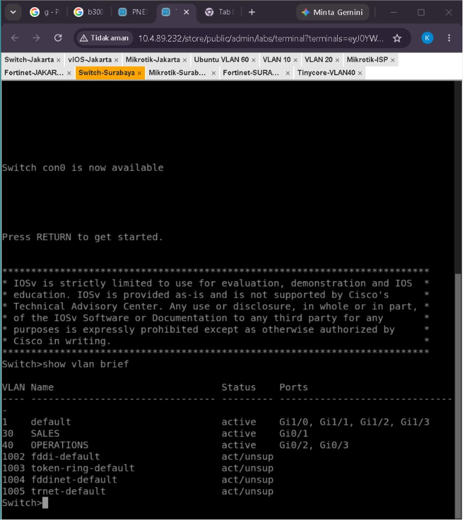
  *VLAN 30 (SALES) aktif pada port Gi0/1, dan VLAN 40 (OPERATIONS) aktif pada port Gi0/2 dan Gi0/3.*

* **Status Trunking (`show interfaces trunk`):**
  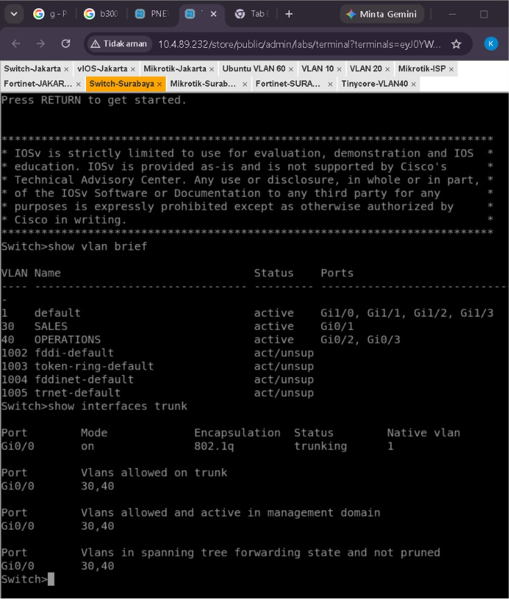
  *Interface Gi0/0 dikonfigurasi sebagai trunk port dengan status trunking.*

---

### 2. MikroTik Router Surabaya
MikroTik Router Surabaya bertindak sebagai gateway internal untuk kantor cabang. Router ini menjalankan local DHCP Server untuk VLAN 30 (Sales) dan routing statis menuju client VLAN 40. Default route diarahkan ke FortiGate Surabaya (10.10.200.1).

* **Alokasi IP Address (`/ip address print`):**
  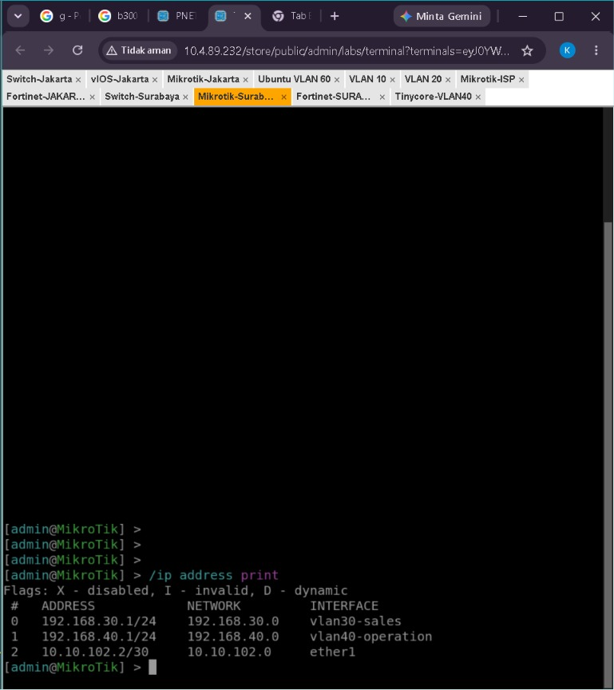
  *IP address gateway dikonfigurasi pada vlan30-sales (192.168.30.1), vlan40-operation (192.168.40.1), dan interface transit ether1 (10.10.102.2/30).*

* **Layanan DHCP Server (`/ip dhcp-server print`):**
  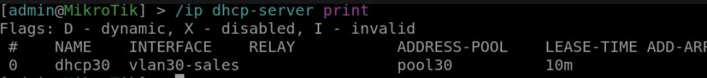
  *DHCP Server (dhcp30) aktif pada interface vlan30-sales.*

* **DHCP Pool (`/ip pool print`):**
  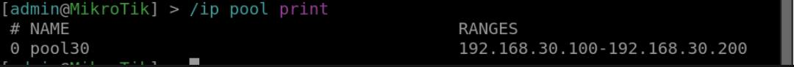
  *IP pool (pool30) didefinisikan dengan range 192.168.30.100 - 192.168.30.200.*

* **Routing Table (`/ip route print`):**
  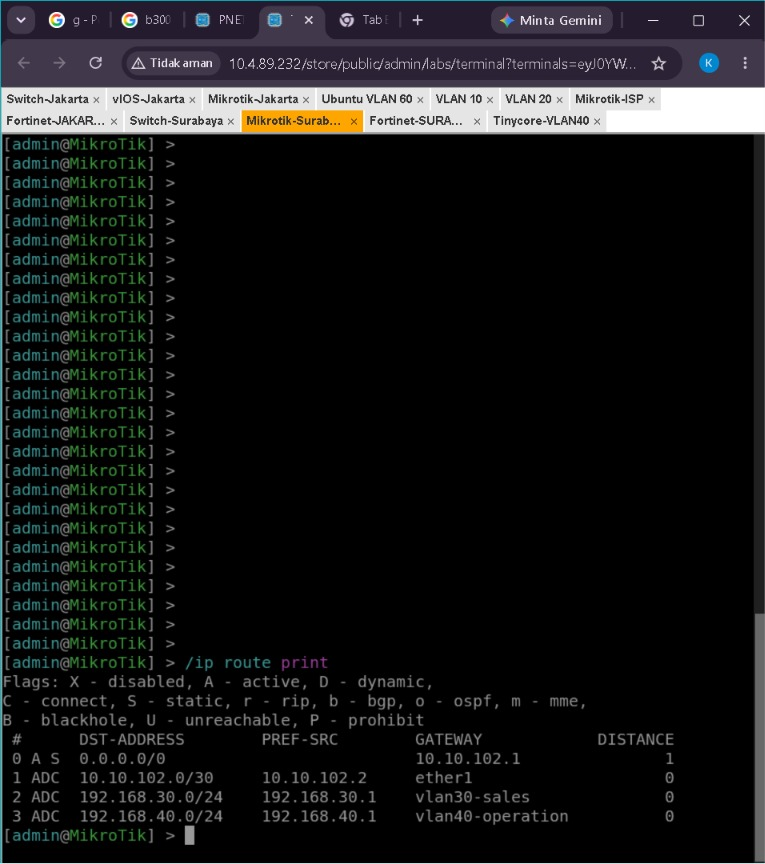
  *Default route diarahkan ke gateway transit FortiGate Surabaya (10.10.102.1).*

* **Alokasi IP DHCP Client VLAN 30 (`ip dhcp` & `show ip`):**
  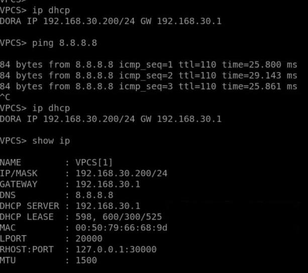
  *Klien VPCS VLAN 30 berhasil memperoleh IP address 192.168.30.200/24 dengan gateway 192.168.30.1 dan DNS 8.8.8.8.*

* **Konektivitas Client VLAN 30 ke Internet (`ping 8.8.8.8`):**
  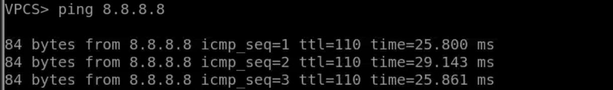
  *Uji ping dari client VLAN 30 ke DNS Google (8.8.8.8) berhasil.*

---

### 3. FortiGate Surabaya
FortiGate Surabaya bertindak sebagai security edge cabang Surabaya, mengurus firewall policy, NAT untuk akses internet, GRE Tunnel endpoint ke Jakarta, serta routing dinamis OSPF.

* **Status Physical Interface (`get system interface physical`):**
  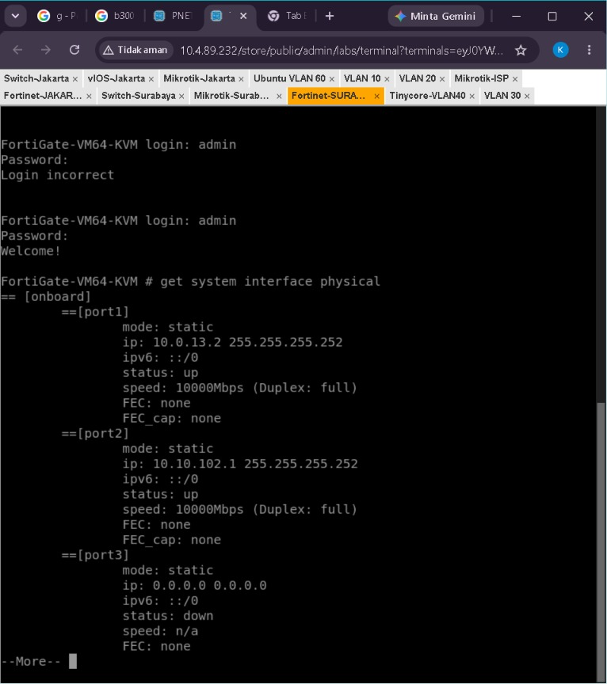
  *Status port1 (WAN) dengan IP 10.0.13.2 dan port2 (transit internal) dengan IP 10.10.102.1 dalam kondisi UP.*

* **Routing Table (`get router info routing-table all`):**
  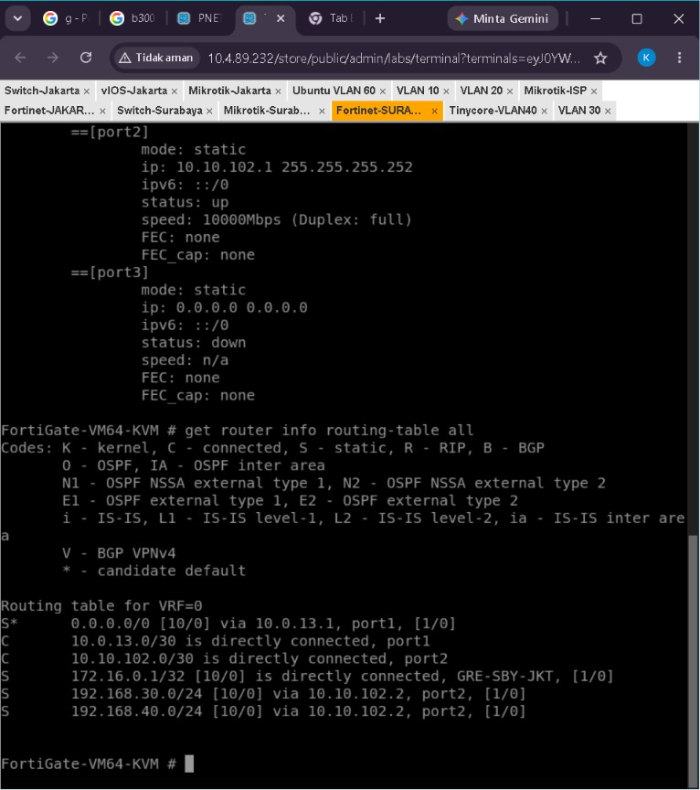
  *Rute default diarahkan via gateway ISP (10.0.13.1), GRE Tunnel (172.16.0.1) terhubung langsung, rute transit internal terhubung langsung, dan rute statis menuju internal Surabaya via MikroTik SBY.*

* **Firewall Policy (`show firewall policy`):**
  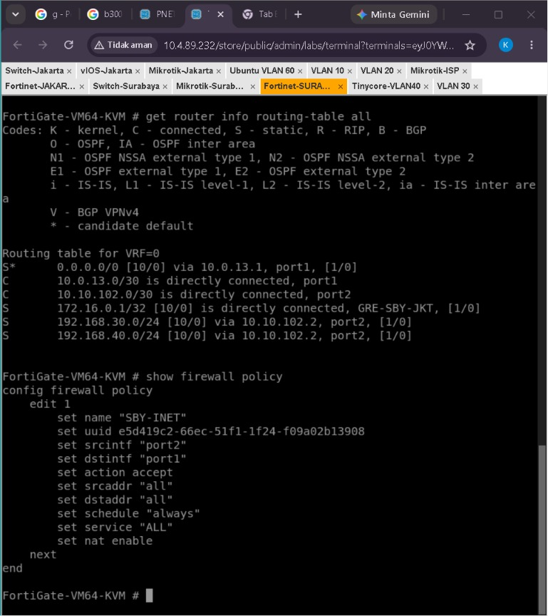
  *Kebijakan firewall SBY-INET mengizinkan traffic keluar dari internal (port2) ke internet (port1 WAN) dengan NAT aktif.*

* **Konektivitas Internet dan Tunnel (`execute ping`):**
  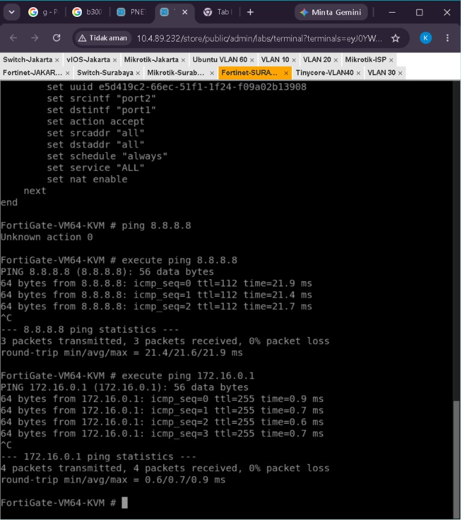
  *Uji ping dari FortiGate Surabaya ke internet (8.8.8.8) dan IP tunnel Jakarta (172.16.0.1) berhasil.*

* **OSPF Neighbor (`get router info ospf neighbor`):**
  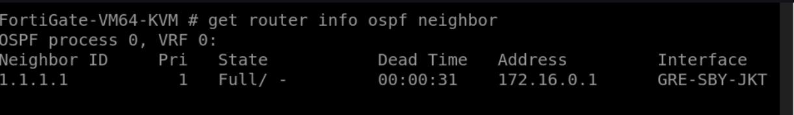
  *Koneksi OSPF neighbor ke FortiGate Jakarta (router-id 1.1.1.1) berstatus FULL via interface GRE-SBY-JKT.*

* **OSPF Routing Table (`get router info routing-table ospf`):**
  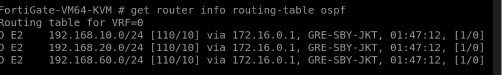
  *FortiGate Surabaya berhasil mempelajari rute internal HQ Jakarta (VLAN 10: 192.168.10.0/24, VLAN 20: 192.168.20.0/24, dan VLAN 60: 192.168.60.0/24) via GRE Tunnel.*

---

# 4. Hasil Pengujian Konektivitas & Routing

## A. Pengujian GRE Tunnel dan OSPF dinamis
Fungsi GRE Tunnel diuji dengan melakukan ping antar endpoint tunnel, sedangkan keberhasilan OSPF diuji dengan terbentuknya neighbor state FULL dan munculnya routing table OSPF.

* **Ping WAN antar-FortiGate (`execute ping 10.0.12.2` dari Surabaya):**
  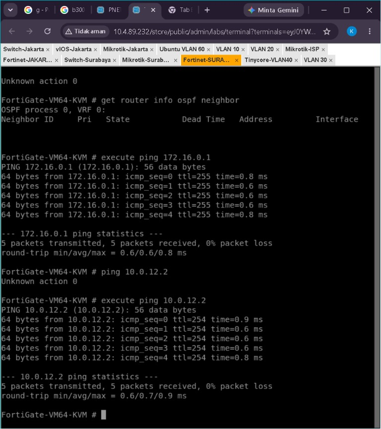
  *Ping dari FortiGate Surabaya ke IP WAN FortiGate Jakarta berhasil.*

* **Ping Tunnel antar-FortiGate (`execute ping 172.16.0.1` dari Surabaya):**
  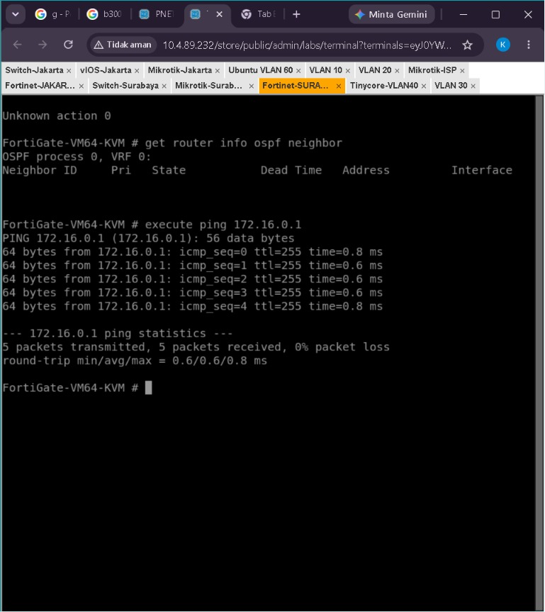
  *Ping dari FortiGate Surabaya ke IP tunnel FortiGate Jakarta berhasil.*

* **OSPF Neighbor Adjacency (`get router info ospf neighbor`):**
  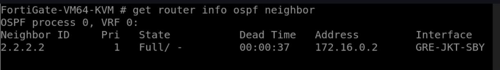
  *Kedua FortiGate telah mencapai status FULL neighbor.*

* **Tabel Routing OSPF (`get router info routing-table ospf`):**
  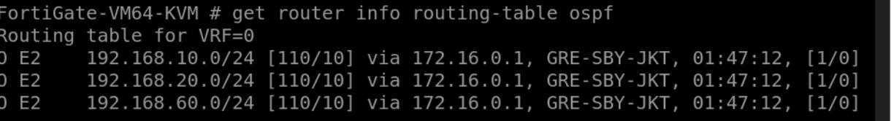
  *OSPF berhasil menyebarkan rute antar kantor pusat dan cabang.*

* **Ping Client Jakarta ke Client Surabaya (`ping 192.168.40.10`):**
  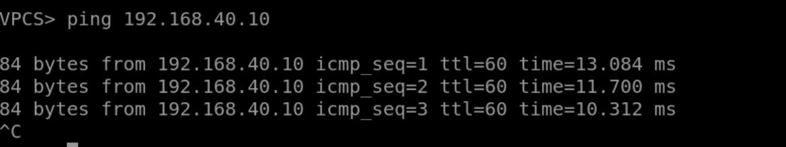
  *Ping dari client Jakarta (VLAN 10) ke client Surabaya (VLAN 40) berhasil.*

* **Ping Client Surabaya ke Client Jakarta (`ping 192.168.10.102`):**
  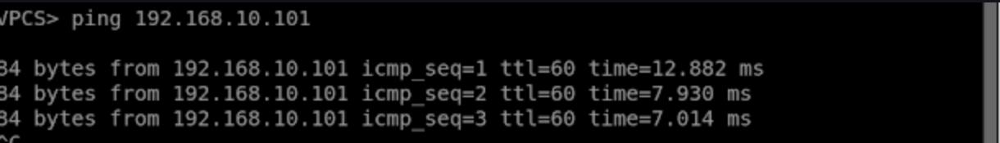
  *Ping dari client Surabaya (VLAN 40) ke client Jakarta (VLAN 10) berhasil.*

---

## B. Pengujian Akhir (End-to-End)

* **Alokasi IP DHCP Client Jakarta (VLAN 10):**
  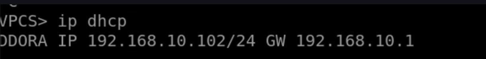
  *Klien VLAN 10 Jakarta mendapat IP 192.168.10.102/24 dari Ubuntu Server via DHCP relay.*

* **Alokasi IP DHCP Client Surabaya (VLAN 30):**
  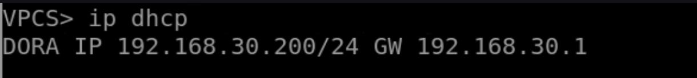
  *Klien VLAN 30 Surabaya mendapat IP 192.168.30.200/24 dari MikroTik Surabaya.*

* **Ping Internet dari Client Jakarta:**
  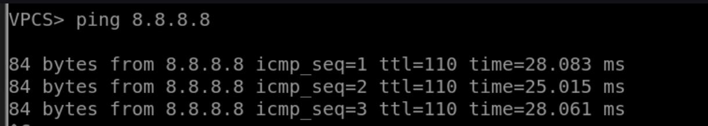
  *Klien Jakarta berhasil terhubung ke internet.*

* **Ping Internet dari Client Surabaya:**
  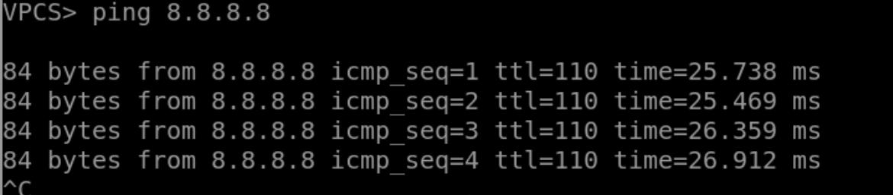
  *Klien Surabaya berhasil terhubung ke internet.*

* **Ping Antar-Site Client Jakarta ke Client Surabaya:**
  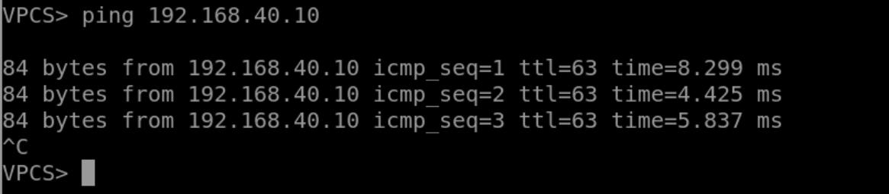
  *Ping antar-site berhasil melalui GRE Tunnel.*

* **Akses Nginx Web Server Jakarta dari Client Surabaya:**
  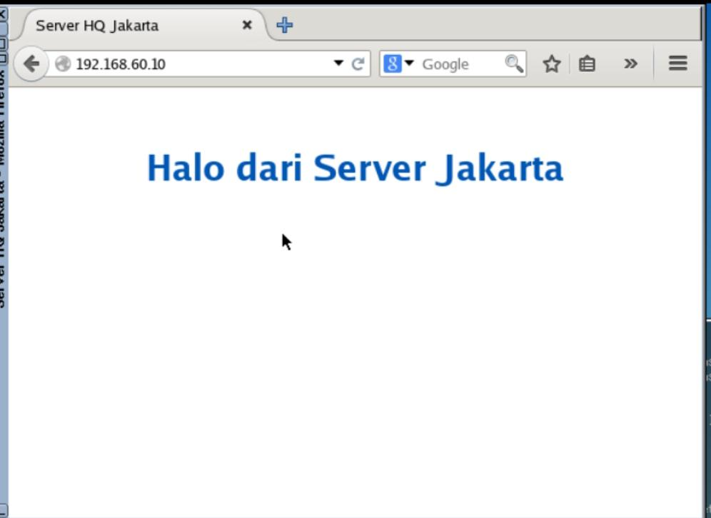
  *Klien Surabaya berhasil mengakses halaman Nginx di Ubuntu Server Jakarta (192.168.60.10) dengan respon "Halo dari Server Jakarta".*

* **OSPF Neighbor Status pada Cabang Surabaya:**
  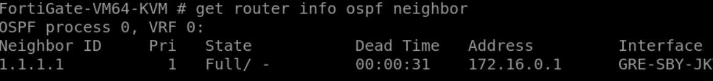
  *Verifikasi status OSPF neighbor di FortiGate Surabaya dalam status FULL.*

* **Traceroute Traffic Client Jakarta ke Client Surabaya:**
  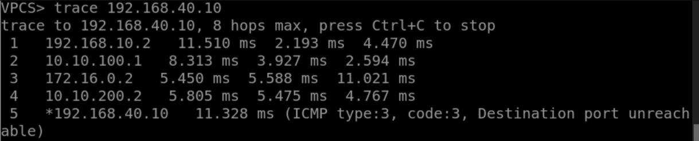
  *Hasil traceroute menunjukkan paket melewati hop:*
  1. `192.168.10.2` (Gateway Fisik Cisco Router Jakarta)
  2. `10.10.100.1` (FortiGate Jakarta Transit)
  3. `172.16.0.2` (IP GRE Tunnel FortiGate Surabaya)
  4. `10.10.200.2` (MikroTik Surabaya Transit)
  5. `192.168.40.10` (PC Destination di VLAN 40)

---

# 5. Analisis dan Kesimpulan

## Analisis
Berdasarkan hasil praktikum Modul 5, segmentasi jaringan lokal berhasil diimplementasikan di kedua sisi (HQ Jakarta menggunakan VLAN 10, 20, 60 dan Branch Surabaya menggunakan VLAN 30, 40). Dual gateway redundansi menggunakan protokol VRRP pada sisi Jakarta bekerja dengan baik; Cisco Router bertindak sebagai Master untuk VLAN 10 & 60, sedangkan MikroTik Router bertindak sebagai Master untuk VLAN 20. Mekanisme DHCP Relay berhasil meneruskan request DORA dari klien Jakarta melewati broadcast domain yang berbeda ke DHCP Server terpusat (Ubuntu Server).

Untuk interkoneksi antar kantor, GRE Tunnel yang dibangun di atas koneksi WAN ISP berfungsi sebagai jalur private virtual. Routing dinamis OSPF yang dijalankan di atas GRE Tunnel berhasil menyebarkan tabel routing secara otomatis antar vendor (FortiGate Jakarta dan FortiGate Surabaya) dengan status FULL neighbor. Hal ini dibuktikan dengan hasil traceroute klien Jakarta ke Surabaya yang berbelok melalui IP GRE Tunnel (172.16.0.2) alih-alih melalui gateway publik ISP langsung. Kebijakan firewall policy dan NAT masquerade pada masing-masing FortiGate juga menjamin keamanan lalu lintas internal sekaligus memberikan akses keluar menuju internet publik.

## Kesimpulan
Seluruh skenario praktikum Modul 5 yang meliputi VLAN segmentasi, trunking trunk port, VRRP dual gateway redundancy, ISC-DHCP relay, FortiGate firewalling & NAT, GRE Tunneling, dan OSPF multi-vendor routing berhasil dikonfigurasi dan diverifikasi dengan benar. Integrasi antar vendor yang berbeda (Cisco, MikroTik, FortiGate, Huawei, Ubuntu, dan ISP) berjalan mulus tanpa masalah interoperabilitas. Jaringan yang dibangun terbukti memiliki ketersediaan yang tinggi (redundansi gateway VRRP) serta jalur komunikasi private yang andal dan aman (GRE over OSPF).
